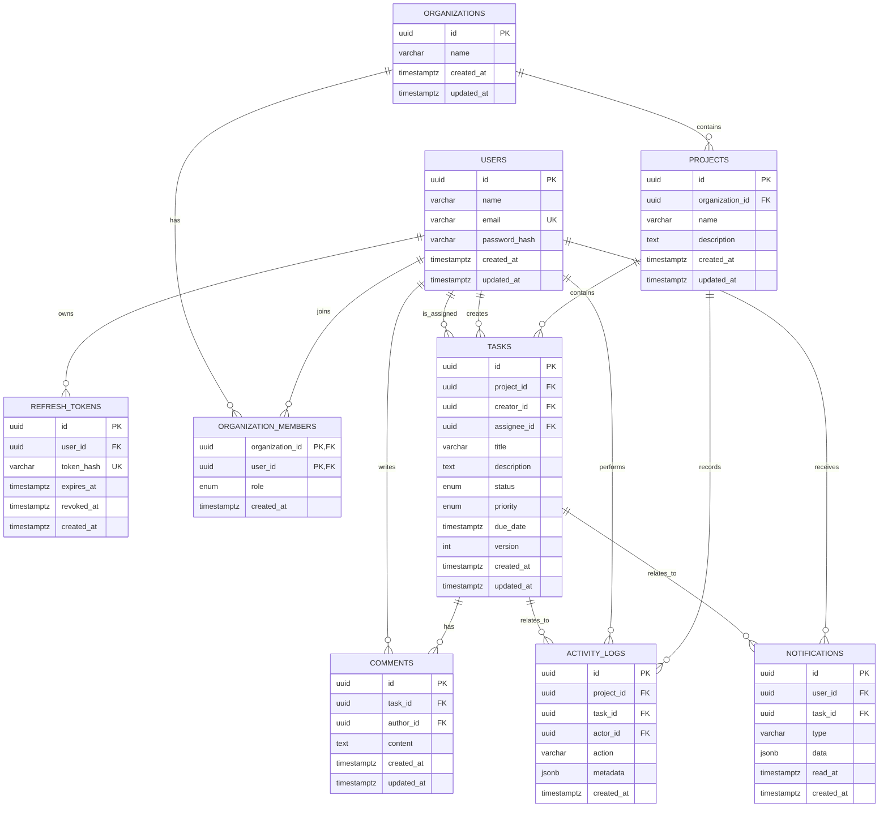

# TeamFlow API

TeamFlow API là backend cho một hệ thống quản lý công việc nhóm, lấy cảm hứng từ
Jira và Trello. Dự án cho phép user đăng ký, đăng nhập, quản lý profile, sau đó
sẽ cộng tác trong organization, project và task.

Mục tiêu chính của project là củng cố nền tảng Node.js Backend và TypeScript
thông qua việc xây dựng từng feature end-to-end với Express.js và PostgreSQL.

## Chức năng

| Chức năng                | Mô tả                                                                               |
| ------------------------ | ----------------------------------------------------------------------------------- |
| User Registration        | User tạo tài khoản bằng tên, email và password; password được hash trước khi lưu.   |
| Authentication           | User login, nhận JWT access token và refresh token, refresh session hoặc logout.    |
| User Profile             | User xem và cập nhật profile của chính mình, gồm tên và email.                      |
| Organization             | User tạo và quản lý không gian làm việc cho team.                                   |
| Member & Role Management | Thêm/xóa thành viên và quản lý các role `OWNER`, `ADMIN`, `MEMBER`.                 |
| Project Management       | Tạo, xem, cập nhật và xóa project trong organization.                               |
| Task Management          | Tạo và quản lý task với title, description, priority, status, due date và assignee. |
| Task Assignment          | Chỉ assign task cho user thuộc cùng organization.                                   |
| Task Workflow            | Kiểm soát các transition trạng thái như `TODO`, `IN_PROGRESS` và `DONE`.            |
| Comments                 | Thành viên thảo luận trên task, chỉnh sửa hoặc xóa comment của mình.                |
| Activity Logs            | Lưu lại các thay đổi quan trọng như task được tạo, giao hoặc đổi trạng thái.        |
| Notifications            | Thông báo khi user được assign task hoặc có comment liên quan.                      |
| Search & Pagination      | Filter, search, sort và phân trang danh sách task.                                  |
| Caching                  | Cache project summary bằng Redis và invalidation khi task thay đổi.                 |
| CSV Export               | Export task của project qua CSV stream mà không tải toàn bộ data vào memory.        |

## Công nghệ sử dụng

- Node.js
- TypeScript
- Express.js
- PostgreSQL
- Drizzle ORM
- Zod
- Argon2id
- JWT (`jose`)
- Docker Compose
- Vitest và Supertest
- Prettier

## Database schema

Sơ đồ dưới đây mô tả data model đầy đủ của TeamFlow, gồm các bảng hiện có và
các bảng theo roadmap. Bảng hiện có trong PostgreSQL: `users`, `refresh_tokens`,
`organizations`, `organization_members`. Các bảng còn lại là thiết kế dự kiến
cho các phase tiếp theo; source of truth của schema đã implement là
`src/database/schema.ts`.



`organization_members` là join table cho quan hệ many-to-many giữa user và
organization. Composite primary key `(organization_id, user_id)` đảm bảo một
user chỉ có một membership trong mỗi organization. Role hiện hỗ trợ `OWNER`,
`ADMIN` và `MEMBER`.

Các bảng theo roadmap:

| Bảng            | Phase dự kiến | Mục đích                                                                               |
| --------------- | ------------- | -------------------------------------------------------------------------------------- |
| `projects`      | Phase 6       | Project thuộc một organization.                                                        |
| `tasks`         | Phase 7–9     | Task, assignee, priority, due date, status workflow và version cho optimistic locking. |
| `comments`      | Phase 10      | Thảo luận trên task.                                                                   |
| `activity_logs` | Phase 11      | Audit trail cho task/project events.                                                   |
| `notifications` | Phase 13      | In-app notification cho user.                                                          |

## Getting Started

### Yêu cầu

- Node.js 20 trở lên
- npm
- Docker và Docker Compose

### Clone project

```bash
git clone <repository-url>
cd teamflow-api
```

Thay `<repository-url>` bằng URL Git repository của bạn.

### Cài đặt dependencies

```bash
npm install
```

### Cấu hình environment variables

```bash
cp .env.example .env
cp .env.test.example .env.test
```

Trước khi chạy production-like environment, thay `JWT_ACCESS_SECRET` trong
`.env` bằng một secret mạnh và riêng tư.

### Khởi động PostgreSQL và migration

```bash
docker compose up -d
npm run db:migrate
npm run db:migrate:test
```

### Chạy development server

```bash
npm run dev
```

API chạy tại:

```text
http://localhost:3000
```

Kiểm tra server:

```bash
curl http://localhost:3000/health
```

Kết quả mong đợi:

```json
{
    "status": "ok"
}
```

### Chạy tests

```bash
npm test
```

### Build project

```bash
npm run build
npm start
```
