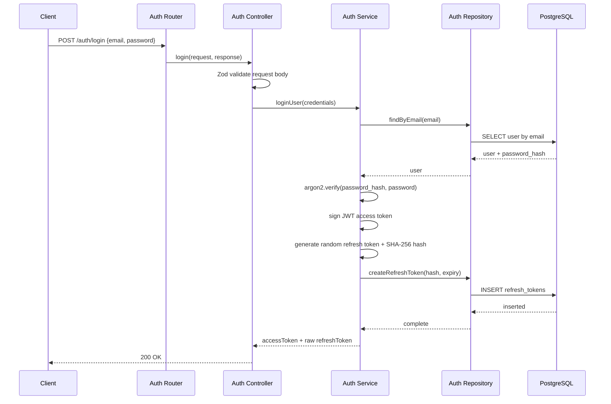
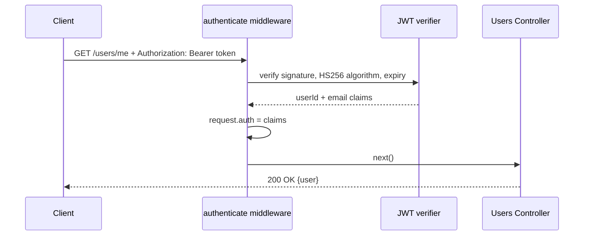
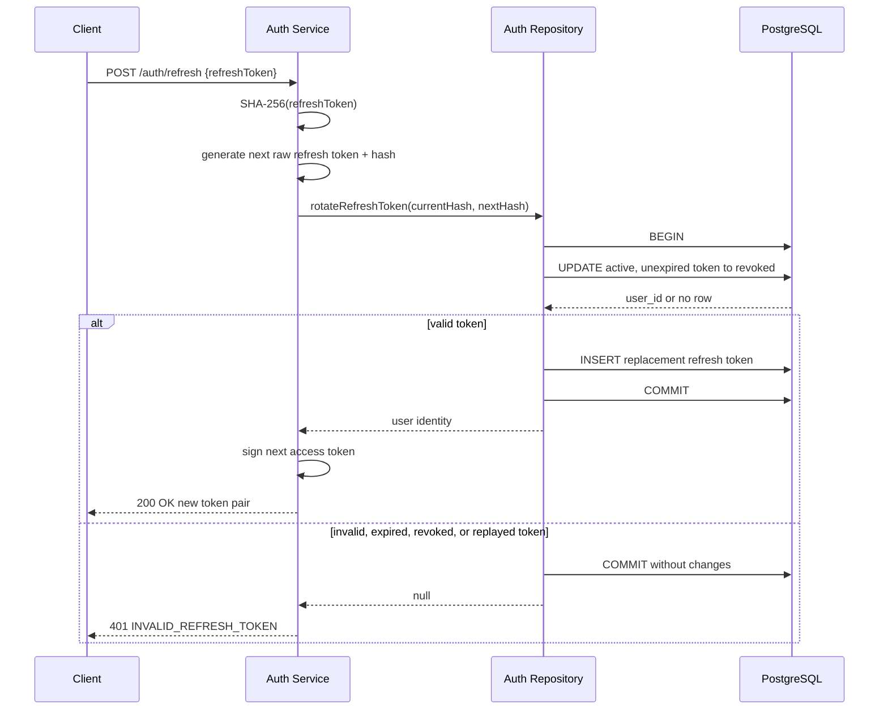
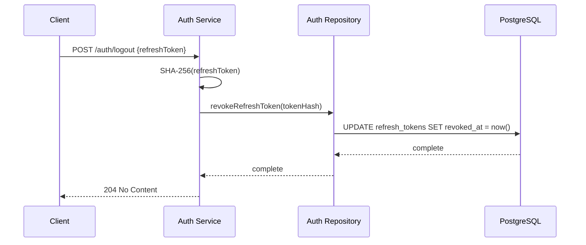

# Login & Authentication Architecture

## API contract

| Endpoint             | Purpose                                                         |
| -------------------- | --------------------------------------------------------------- |
| `POST /auth/login`   | Verify email/password and issue tokens.                         |
| `POST /auth/refresh` | Consume a refresh token and issue a rotated token pair.         |
| `POST /auth/logout`  | Revoke a refresh token.                                         |
| `GET /users/me`      | Temporary protected endpoint to verify access-token middleware. |

`POST /auth/login` accepts:

```json
{
    "email": "jane@example.com",
    "password": "secure-password"
}
```

Successful login and refresh return:

```json
{
    "accessToken": "jwt",
    "refreshToken": "opaque-random-token"
}
```

## Token design

Access tokens are short-lived JWTs signed with HS256. They contain only the
subject user ID and email needed by the authentication middleware.

Refresh tokens are high-entropy random values, not JWTs. The API returns the raw
value once, but PostgreSQL stores only its SHA-256 hash. This gives logout and
refresh rotation server-side state while limiting the impact of a database leak.

## Sequence diagrams

### Login



### Protected endpoint



### Refresh-token rotation



### Logout



```text
Login
  -> verify Argon2 password hash
  -> sign short-lived JWT access token
  -> generate random refresh token
  -> hash refresh token
  -> persist hash and expiry
  -> return raw refresh token once
```

## Refresh rotation

```text
POST /auth/refresh
  -> hash supplied refresh token
  -> atomically mark matching active token revoked
  -> create a replacement token row in the same transaction
  -> sign new access token
  -> return new token pair
```

The repository revokes the old token with a conditional update requiring:

- matching token hash;
- `revoked_at IS NULL`;
- `expires_at > now`.

Only one concurrent refresh request can consume a token. A replay of the old
token returns `401 INVALID_REFRESH_TOKEN`.

## Protected request flow

```text
Client: Authorization: Bearer <access-token>
  -> authenticate middleware
  -> verify JWT signature, algorithm, and expiration
  -> attach { userId, email } to request.auth
  -> protected controller
  -> response
```

`GET /users/me` currently returns the authenticated token context. Phase 3 will
replace this temporary verification behavior with the complete user-profile read
and update feature.

## Error responses

| Situation                                            | Status | Code                      |
| ---------------------------------------------------- | -----: | ------------------------- |
| Invalid login body                                   |    400 | `INVALID_INPUT`           |
| Wrong email or password                              |    401 | `INVALID_CREDENTIALS`     |
| Missing bearer token                                 |    401 | `AUTHENTICATION_REQUIRED` |
| Invalid or expired access token                      |    401 | `INVALID_ACCESS_TOKEN`    |
| Invalid, expired, revoked, or replayed refresh token |    401 | `INVALID_REFRESH_TOKEN`   |
| Malformed JSON                                       |    400 | `INVALID_JSON`            |
| Unexpected infrastructure error                      |    500 | `INTERNAL_SERVER_ERROR`   |

The login error intentionally does not disclose whether email or password was
incorrect.

## Persistence

Migration `0001_huge_hobgoblin.sql` adds `refresh_tokens`:

```text
id
user_id -> users.id (ON DELETE CASCADE)
token_hash UNIQUE
expires_at
revoked_at
created_at
```

Indexes on `user_id` and `expires_at` support token lookup/cleanup patterns.
The `token_hash` unique constraint prevents duplicate stored hashes.

## Module responsibilities

```text
src/modules/auth/
  auth.schema.ts       Request contracts for register/login/refresh.
  auth.controller.ts   HTTP handlers.
  auth.service.ts      Password verification and token lifecycle rules.
  auth.repository.ts   User and refresh-token persistence/transaction.
  auth.token.ts        JWT signing/verification and refresh-token generation.
  auth.route.ts        /auth route declarations.

src/middleware/authenticate.ts
  Bearer-token extraction, verification, and request.auth context.

src/modules/users/
  Temporary protected /users/me endpoint.
```

## Verification

```bash
docker compose up -d
npm run db:migrate
npm run db:migrate:test
npm test
```

The integration suite covers valid/invalid login, protected access, invalid and
expired access tokens, refresh rotation/replay protection, and logout revocation.
