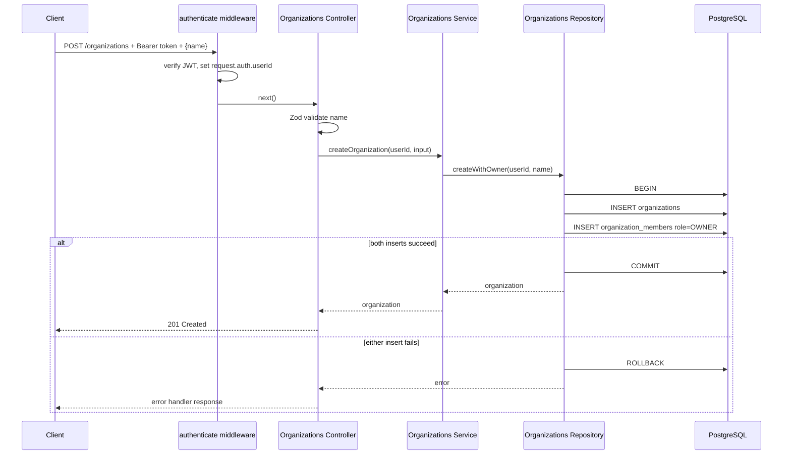
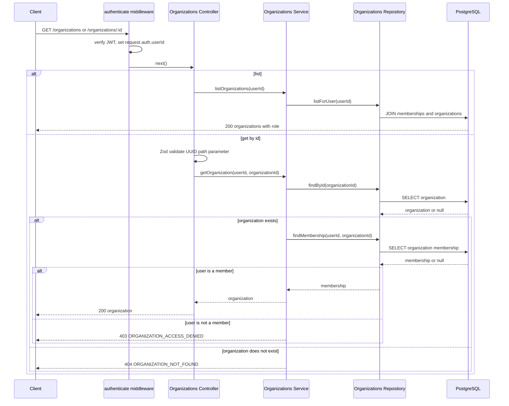
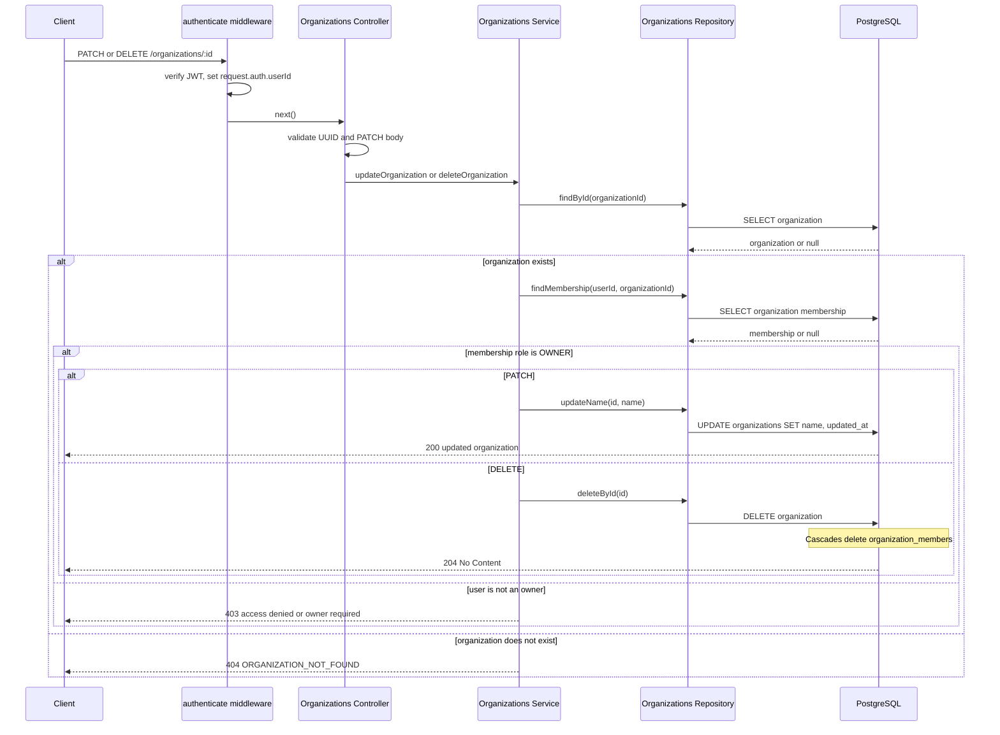

# Organization Management Architecture

## API contract

| Method   | Endpoint             | Purpose                                                 |
| -------- | -------------------- | ------------------------------------------------------- |
| `POST`   | `/organizations`     | Create an organization and owner membership.            |
| `GET`    | `/organizations`     | List organizations belonging to the authenticated user. |
| `GET`    | `/organizations/:id` | Read an organization when the user is a member.         |
| `PATCH`  | `/organizations/:id` | Rename an organization when the user is its owner.      |
| `DELETE` | `/organizations/:id` | Delete an organization when the user is its owner.      |

Create/update bodies use the same shape:

```json
{
    "name": "Engineering"
}
```

All endpoints require a bearer access token. Phase 4 creates the role model;
only `OWNER` authorization is needed for update/delete. Phase 5 will add member
management and full `OWNER`/`ADMIN`/`MEMBER` authorization rules.

## Persistence model

```text
users
  -> organization_members <- organizations
```

`organization_members` is the many-to-many join table. Its composite primary
key `(organization_id, user_id)` ensures one membership per user/organization
pair. Both foreign keys use `ON DELETE CASCADE`.

The role enum supports `OWNER`, `ADMIN`, and `MEMBER`. The creator receives
`OWNER` at creation time.

## Sequence diagrams

### Create organization and owner membership



### Read organization/list organizations



### Update or delete organization



## Module responsibilities

```text
src/modules/organizations/
  organizations.route.ts       Authenticated route declarations.
  organizations.controller.ts  HTTP request/response mapping.
  organizations.schema.ts      Zod body and UUID path validation.
  organizations.service.ts     Membership/owner authorization rules.
  organizations.repository.ts  Transaction and PostgreSQL queries.
```

`getAuthenticatedUserId` is shared because multiple controllers convert the
authentication middleware context into an application-level user ID.

## Error responses

| Situation                          | Status | Code                           |
| ---------------------------------- | -----: | ------------------------------ |
| Missing/invalid bearer token       |    401 | Authentication middleware code |
| Invalid UUID or organization name  |    400 | `INVALID_INPUT`                |
| Authenticated user is not a member |    403 | `ORGANIZATION_ACCESS_DENIED`   |
| Member without owner permission    |    403 | `ORGANIZATION_OWNER_REQUIRED`  |
| Organization no longer exists      |    404 | `ORGANIZATION_NOT_FOUND`       |

## Verification

```bash
docker compose up -d
npm run db:generate
npm run db:migrate
npm run db:migrate:test
npm test
```

Integration tests cover create, creator ownership, list, get, owner update,
unauthorized update, delete, authentication, and validation.
