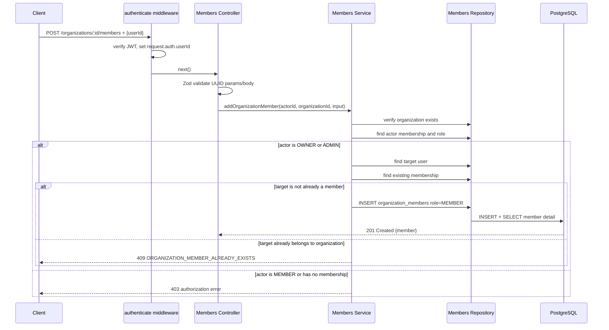
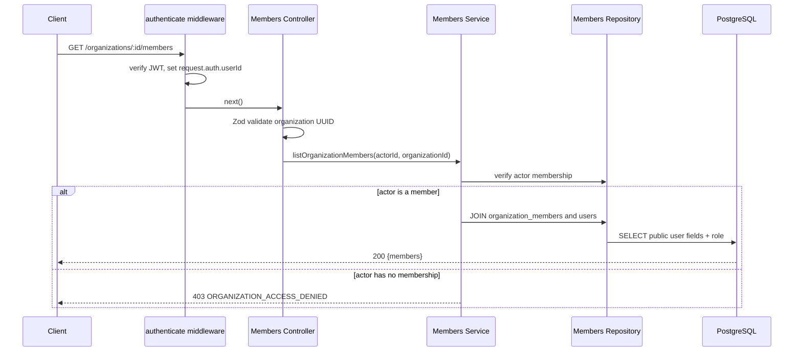
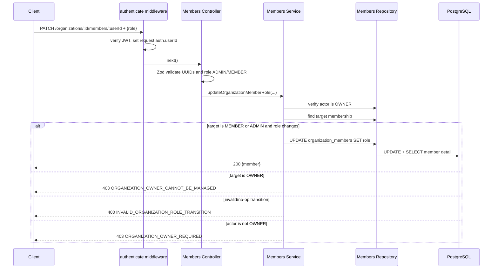
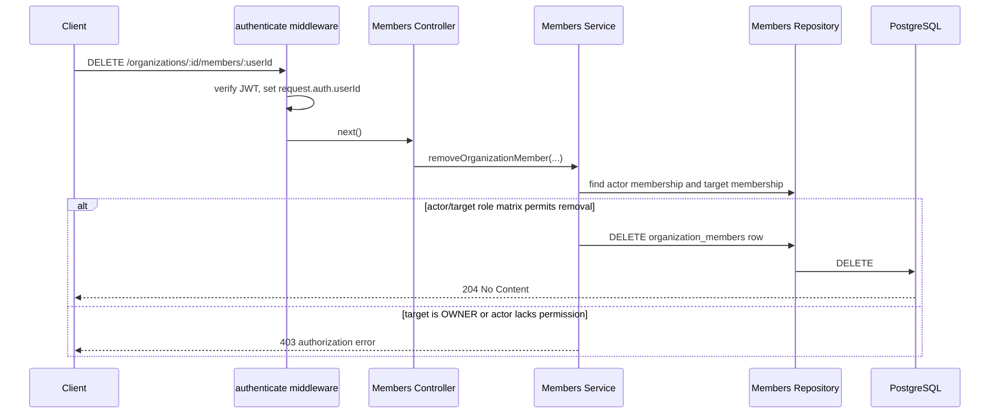

# Organization Members & RBAC Architecture

## API contract

| Method   | Endpoint                             | Permission                                                        |
| -------- | ------------------------------------ | ----------------------------------------------------------------- |
| `POST`   | `/organizations/:id/members`         | `OWNER` or `ADMIN`; adds target as `MEMBER`.                      |
| `GET`    | `/organizations/:id/members`         | Any organization member.                                          |
| `PATCH`  | `/organizations/:id/members/:userId` | `OWNER`; switches `MEMBER` and `ADMIN`.                           |
| `DELETE` | `/organizations/:id/members/:userId` | `OWNER` may remove `MEMBER`/`ADMIN`; `ADMIN` may remove `MEMBER`. |

The API does not expose an endpoint to assign or remove `OWNER`. Ownership
transfer is deliberately outside Phase 5 so an organization cannot accidentally
lose its only owner.

## Role matrix

| Actor \ Target action | Add MEMBER | Remove MEMBER | Remove ADMIN | Promote MEMBER → ADMIN | Demote ADMIN → MEMBER | Manage OWNER |
| --------------------- | ---------: | ------------: | -----------: | ---------------------: | --------------------: | -----------: |
| OWNER                 |        Yes |           Yes |          Yes |                    Yes |                   Yes |           No |
| ADMIN                 |        Yes |           Yes |           No |                     No |                    No |           No |
| MEMBER                |         No |            No |           No |                     No |                    No |           No |

## Sequence diagrams

### Add organization member



### List members



### Promote/demote member role



### Remove member



## Module responsibilities

```text
src/modules/organizations/
  organizations.authorization.ts        Shared organization/membership role checks.
  organization-members.schema.ts        Request and route parameter DTO schemas.
  organization-members.controller.ts    HTTP handlers for member APIs.
  organization-members.service.ts       RBAC/business rules and response mapping.
  organization-members.repository.ts    Membership persistence and user join queries.
```

The existing `organization_members` table and `organization_role` enum from
Phase 4 provide the persistence model; Phase 5 adds behavior, not a new table.

## Error responses

| Situation                         | Status | Code                                    |
| --------------------------------- | -----: | --------------------------------------- |
| User is not in organization       |    403 | `ORGANIZATION_ACCESS_DENIED`            |
| MEMBER attempts member management |    403 | `ORGANIZATION_MEMBER_MANAGEMENT_DENIED` |
| Non-owner attempts role update    |    403 | `ORGANIZATION_OWNER_REQUIRED`           |
| Attempt to modify/remove OWNER    |    403 | `ORGANIZATION_OWNER_CANNOT_BE_MANAGED`  |
| Target user is already a member   |    409 | `ORGANIZATION_MEMBER_ALREADY_EXISTS`    |
| Target membership does not exist  |    404 | `ORGANIZATION_MEMBER_NOT_FOUND`         |
| Invalid or no-op role transition  |    400 | `INVALID_ORGANIZATION_ROLE_TRANSITION`  |

## Verification

```bash
docker compose up -d
npm run db:migrate
npm run db:migrate:test
npm test
```

Integration tests cover the OWNER/ADMIN/MEMBER matrix, duplicate membership,
invalid role input, and member listing.
