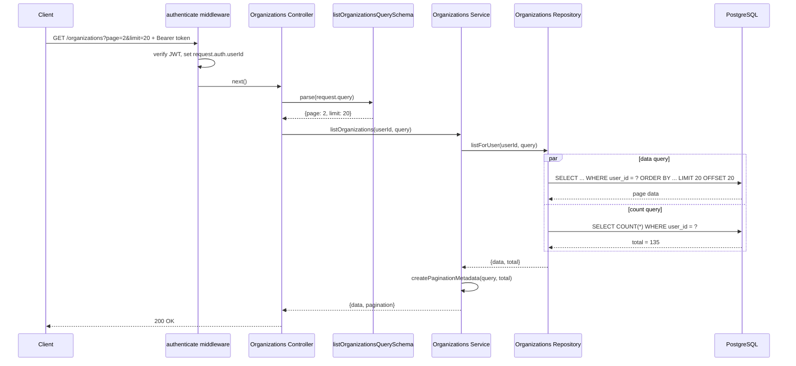

# Shared Pagination

## Purpose

Shared pagination provides reusable mechanics for list endpoints without
abstracting domain query semantics. It owns validation of `page`/`limit`, offset
calculation, and response metadata. Each feature still owns its filters, search,
sorting, joins, authorization predicate, and default ordering.

## Shared API

```text
src/shared/pagination/
  pagination.schema.ts  Zod query and metadata schemas
  pagination.types.ts   types inferred from Zod
  pagination.utils.ts   offset and metadata calculation
```

Supported query parameters:

```text
page  >= 1, default 1
limit >= 1 and <= 100, default 20
```

Zod coercion changes HTTP query strings such as `?page=2&limit=20` into the
validated numeric query:

```ts
{
    page: 2,
    limit: 20,
}
```

## Organization integration

Organization extends the shared schema locally:

```ts
const listOrganizationsQuerySchema = paginationSchema.extend({});
```

Future Organization-specific fields can be added here without affecting other
modules:

```ts
const listOrganizationsQuerySchema = paginationSchema.extend({
    search: z.string().trim().optional(),
    sortBy: z.enum(["name", "createdAt"]).optional(),
});
```

This feature does not implement search or dynamic sorting yet. Organization
repository currently chooses its own deterministic default order:
`created_at DESC, id DESC`.

## Sequence diagram



## SQL concepts

Offset pagination uses:

```sql
SELECT ...
FROM organization_members
JOIN organizations ON ...
WHERE organization_members.user_id = $1
ORDER BY organizations.created_at DESC, organizations.id DESC
LIMIT $2 OFFSET $3;

SELECT COUNT(*)
FROM organization_members
WHERE user_id = $1;
```

The offset formula is:

```text
offset = (page - 1) * limit
```

For `page=2`, `limit=20`, the database skips the first 20 records and returns
the next 20.

Data and count queries run concurrently through `Promise.all` because both are
read-only and use the identical authorization predicate. They are not a strict
single snapshot: concurrent membership changes between queries can make `total`
slightly differ from the page data. That trade-off is normal for simple offset
pagination.

## Response contract

```json
{
    "data": [],
    "pagination": {
        "page": 2,
        "limit": 20,
        "total": 135,
        "totalPages": 7,
        "hasNextPage": true,
        "hasPreviousPage": true
    }
}
```

## Reuse

Projects, tasks, users, and other list endpoints can reuse:

```ts
paginationSchema;
getPaginationOffset(query);
createPaginationMetadata(query, total);
```

Each module retains its own repository query and extends the base schema only
with domain-specific query parameters. No generic dynamic filter/search/sort
engine is required.

## Offset pagination trade-offs

Offset pagination is easy for page-number UIs, direct links, and total-page
metadata. Its drawbacks are increasingly expensive large offsets and unstable
pages if records are inserted/deleted while a user navigates.

Consider cursor pagination for very large task lists, infinite scroll, or APIs
requiring stable traversal. A cursor typically uses a deterministic ordering
field such as `(created_at, id)` rather than an integer offset.
