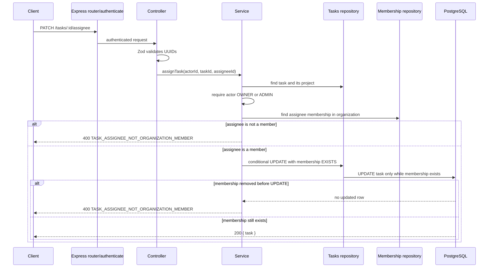

# Task Assignment Architecture

## API contract

```http
PATCH /tasks/:id/assignee
Authorization: Bearer <access-token>
Content-Type: application/json

{
  "assigneeId": "uuid"
}
```

`OWNER` and `ADMIN` may assign or reassign a task. The assignee must be a
current member of the organization that owns the task's project. `MEMBER` may
not assign tasks.

| Situation                                 | Status | Error code                                                  |
| ----------------------------------------- | -----: | ----------------------------------------------------------- |
| Task does not exist                       |    404 | `TASK_NOT_FOUND`                                            |
| Actor lacks project-management permission |    403 | `PROJECT_MANAGEMENT_DENIED` or `ORGANIZATION_ACCESS_DENIED` |
| Assignee is not an organization member    |    400 | `TASK_ASSIGNEE_NOT_ORGANIZATION_MEMBER`                     |

## Assignment flow



## Data-integrity decision

The membership check in the service gives a useful application error. The
repository repeats the check inside the `UPDATE ... WHERE EXISTS (...)` query.
That conditional write closes the time-of-check/time-of-use gap for the target:
if their membership disappears between validation and mutation, PostgreSQL
updates no task row.

This does not lock the actor's role for the whole operation. More sensitive
operations may require an explicit transaction and row locking; that extra
complexity is unnecessary for this focused assignment slice.

## Verification

```bash
docker compose up -d
npm run db:migrate
npm run db:migrate:test
npm run format:check
npm run typecheck
npm run build
npm test
git diff --check
```
