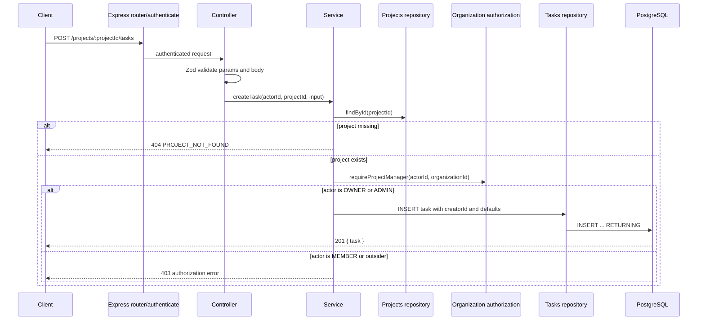
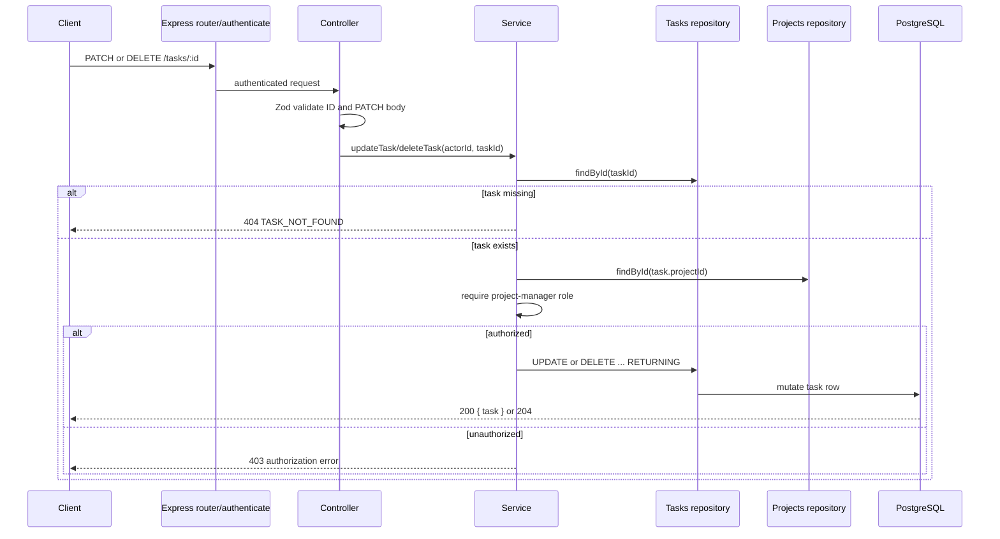

# Task Management Architecture

## API contract

| Method   | Endpoint                     | Permission                                       |
| -------- | ---------------------------- | ------------------------------------------------ |
| `POST`   | `/projects/:projectId/tasks` | `OWNER` or `ADMIN` of the project's organization |
| `GET`    | `/projects/:projectId/tasks` | Any organization member                          |
| `GET`    | `/tasks/:id`                 | Any organization member                          |
| `PATCH`  | `/tasks/:id`                 | `OWNER` or `ADMIN`                               |
| `DELETE` | `/tasks/:id`                 | `OWNER` or `ADMIN`                               |

`POST` creates a task with `status = TODO`, `priority = MEDIUM`, and no
assignee unless a supported creation field provides a priority or due date.
Assignment is intentionally deferred to Phase 8 and status transitions to
Phase 9, so neither `assigneeId` nor `status` is accepted by the CRUD API.

## Persistence and integrity

`tasks.project_id` is a foreign key to `projects.id` with `ON DELETE CASCADE`.
Deleting a project therefore cannot leave orphan tasks. `creator_id` is a
required user reference, while `assignee_id` is nullable for the later
assignment feature. The `(project_id, created_at)` index supports the task-list
query and its stable newest-first ordering.

## Create task flow



## Update and delete flows



## Module responsibilities

```text
src/modules/tasks/
  tasks.route.ts        Endpoint composition and authentication.
  tasks.controller.ts   HTTP input/output and Zod parsing.
  tasks.service.ts      Task rules and project/organization authorization.
  tasks.repository.ts   Task SQL through Drizzle.
  tasks.schema.ts       Request DTOs and route/query schemas.
```

## Verification

```bash
docker compose up -d
npm run db:migrate
npm run db:migrate:test
npm run format:check
npm run typecheck
npm run build
npm test
git diff --check
```
