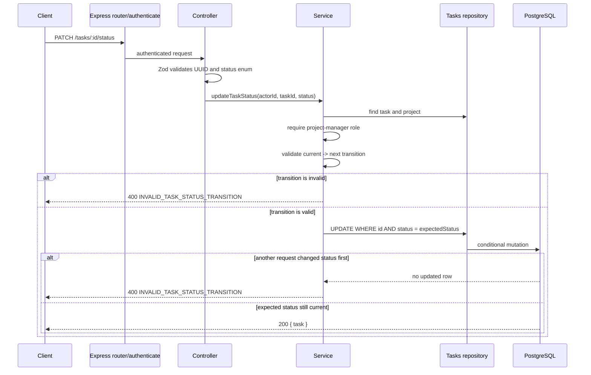

# Task Workflow Architecture

## API contract

```http
PATCH /tasks/:id/status
Authorization: Bearer <access-token>
Content-Type: application/json

{
  "status": "IN_PROGRESS"
}
```

Only `OWNER` and `ADMIN` of the task's organization may transition status.
Allowed transitions are:

```text
TODO        -> IN_PROGRESS
IN_PROGRESS -> TODO | DONE
DONE        -> IN_PROGRESS
```

| Situation                              | Status | Error code                       |
| -------------------------------------- | -----: | -------------------------------- |
| Unknown status value                   |    400 | `INVALID_INPUT`                  |
| Invalid, repeated, or stale transition |    400 | `INVALID_TASK_STATUS_TRANSITION` |
| Task does not exist                    |    404 | `TASK_NOT_FOUND`                 |
| Actor cannot manage the project        |    403 | authorization error              |

## Status transition flow



## Concurrency decision

The service reads the current status to select an allowed transition. The
repository then includes that current status in the SQL `WHERE` clause. Two
concurrent `TODO -> IN_PROGRESS` requests therefore cannot both succeed: the
first changes the row and the second no longer matches `status = TODO`.

This is optimistic concurrency control without a version column. A `version`
column becomes useful if later operations need clients to detect arbitrary
concurrent edits across multiple fields; status transitions already have a
natural expected-state value.

## Verification

```bash
docker compose up -d
npm run db:migrate
npm run db:migrate:test
npm run format:check
npm run typecheck
npm run build
npm test
git diff --check
```
