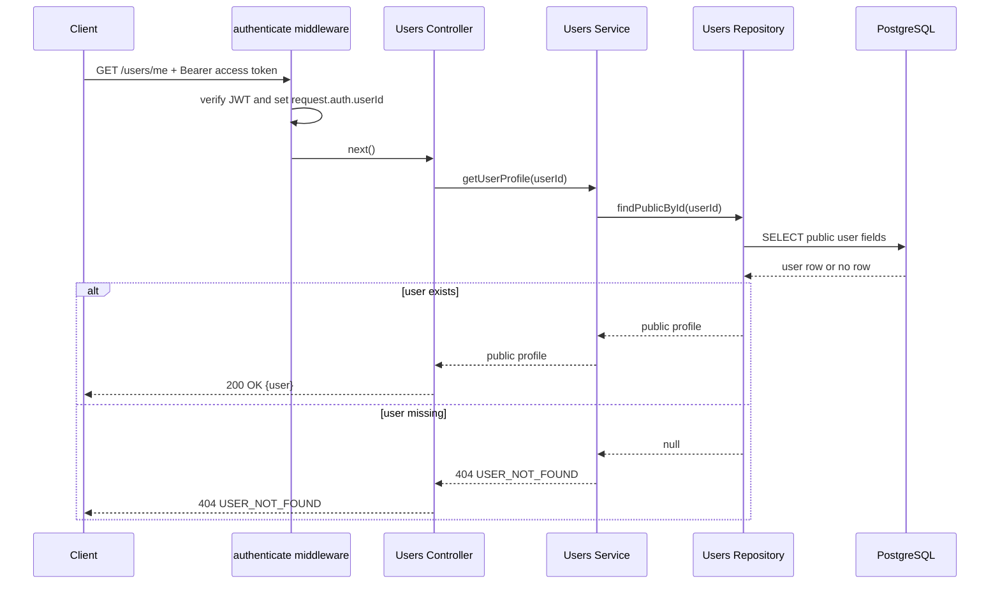
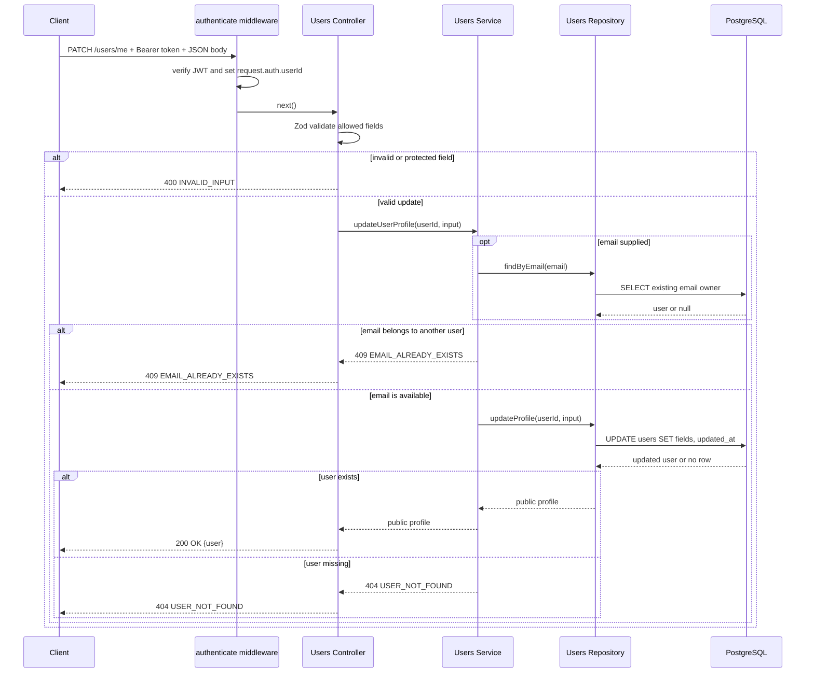

# User Profile Architecture

## API contract

| Endpoint          | Purpose                                                |
| ----------------- | ------------------------------------------------------ |
| `GET /users/me`   | Read the authenticated user's persisted profile.       |
| `PATCH /users/me` | Update the authenticated user's `name` and/or `email`. |

`PATCH /users/me` accepts at least one permitted field:

```json
{
    "name": "Jane Smith",
    "email": "jane.smith@example.com"
}
```

The schema is strict. It rejects empty updates and protected fields such as `id`,
`passwordHash`, and `createdAt`.

## Request flow

```text
HTTP request
  -> authenticate middleware
  -> request.auth user identity
  -> users route
  -> users controller
  -> Zod validation for PATCH
  -> users service
  -> users repository
  -> PostgreSQL
  -> JSON response
```

## Sequence diagrams

### Read current profile



### Update current profile



## Module responsibilities

```text
src/modules/users/
  users.route.ts        Mounts authenticated GET/PATCH /me handlers.
  users.controller.ts   Maps HTTP input/output to application calls.
  users.schema.ts       Strict PATCH request contract.
  users.service.ts      Profile rules and email-conflict mapping.
  users.repository.ts   Public-field SELECT/UPDATE queries.
  index.ts              Users module public exports.
```

`authenticate` is middleware because it is cross-cutting HTTP behavior. It
verifies the access token once and attaches minimal identity to `request.auth`.
The users service receives only `userId` and validated input, never Express
objects.

## Data integrity and security

The update schema does not contain password or system-managed fields. Repository
queries select/return public fields only, so `passwordHash` cannot leak in a
profile response.

When email changes, service pre-checks existing ownership to return a clear
`409 EMAIL_ALREADY_EXISTS`. PostgreSQL `UNIQUE(email)` remains the final guard:
if concurrent requests both pass the pre-check, the database rejects one and
the service maps error `23505` to the same `409` response.

`updatedAt` is set explicitly in the update query because PostgreSQL does not
automatically modify a timestamp column on update without a trigger.

## Error responses

| Situation                           | Status | Code                      |
| ----------------------------------- | -----: | ------------------------- |
| Missing bearer token                |    401 | `AUTHENTICATION_REQUIRED` |
| Invalid or expired access token     |    401 | `INVALID_ACCESS_TOKEN`    |
| Empty/invalid/protected PATCH field |    400 | `INVALID_INPUT`           |
| Email owned by another user         |    409 | `EMAIL_ALREADY_EXISTS`    |
| Token refers to deleted user        |    404 | `USER_NOT_FOUND`          |

## Verification

```bash
docker compose up -d
npm run db:migrate
npm run db:migrate:test
npm test
```

Integration tests cover profile read, update, unauthenticated access, strict
PATCH validation, and duplicate email behavior.
