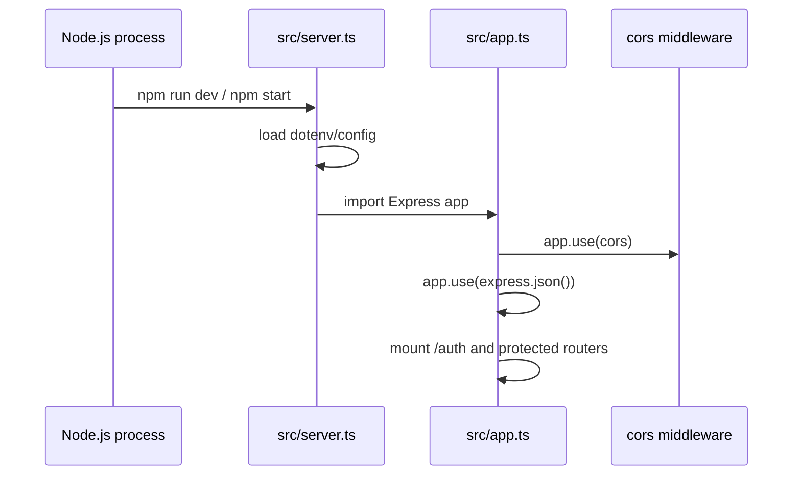
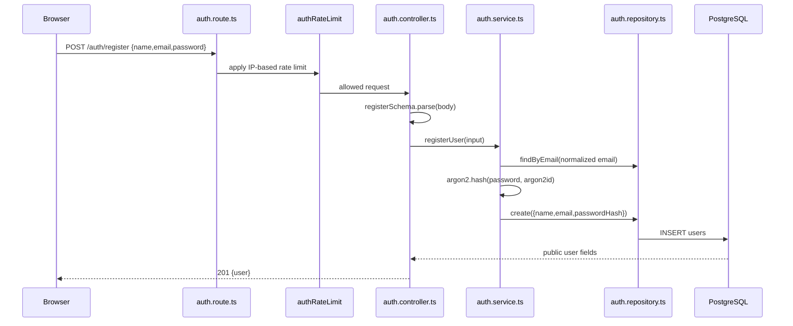
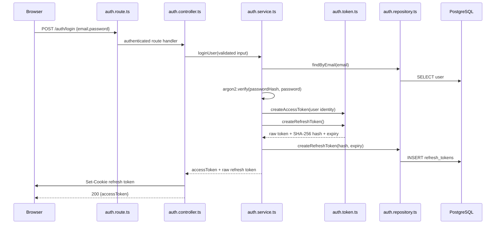
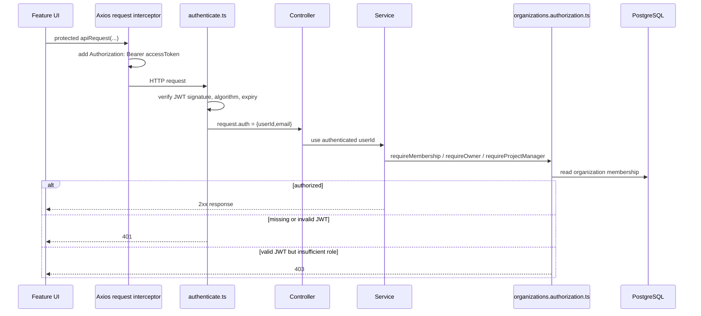
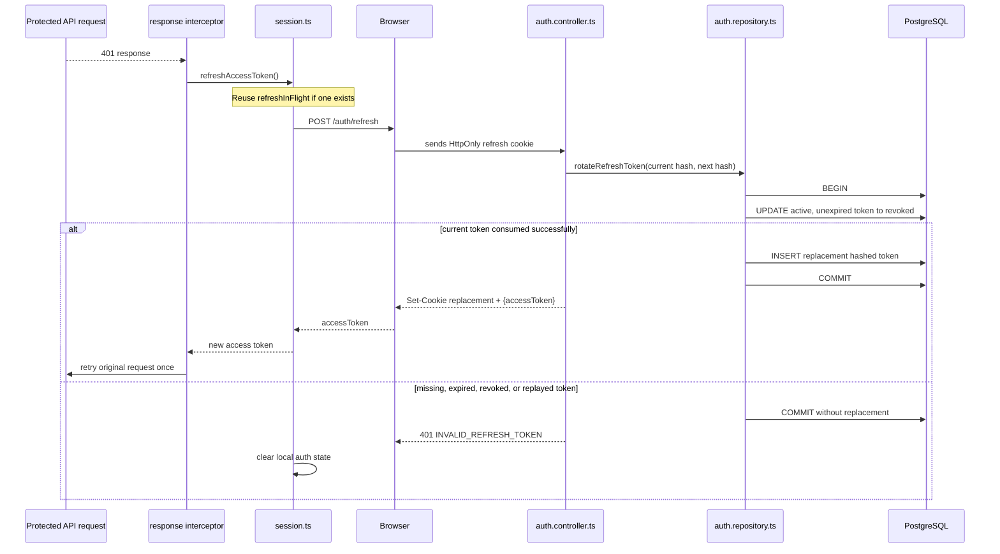
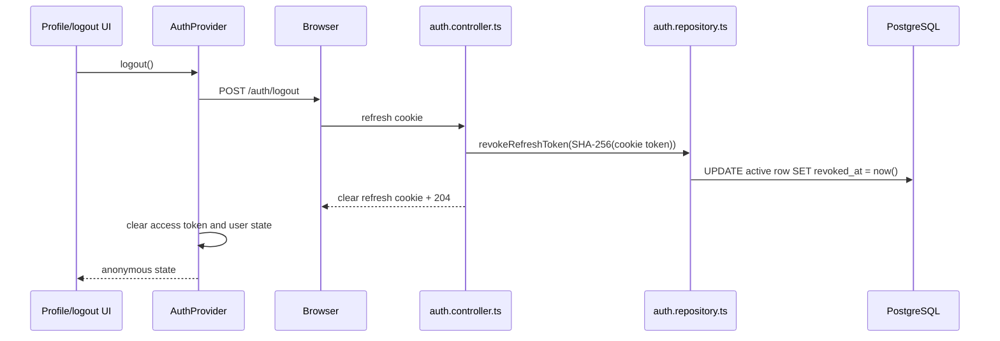

# Bài 11: Authentication Flow và Code Review Guide

Tài liệu này mô tả luồng xác thực hiện tại của TeamFlow API và TeamFlow Web.
Mục tiêu là đọc source theo đúng thứ tự request đi qua hệ thống, hiểu vì sao mỗi
lớp tồn tại, và có checklist để review thủ công.

## 1. Kiến trúc session hiện tại

```text
Browser / TeamFlow Web
  |
  | access token: Authorization: Bearer <JWT>
  | refresh token: HttpOnly cookie tự gửi cho /auth/*
  v
TeamFlow API
  |
  v
PostgreSQL
  - users
  - refresh_tokens (chỉ lưu SHA-256 hash)
```

Hai token có trách nhiệm khác nhau:

| Token         | Nơi giữ                        | Mục đích                                      | Thời hạn mặc định |
| ------------- | ------------------------------ | --------------------------------------------- | ----------------- |
| Access token  | JavaScript memory của frontend | Gọi protected API qua bearer header           | 15 phút           |
| Refresh token | Browser `HttpOnly` cookie      | Lấy access token mới khi access token hết hạn | 7 ngày            |

Refresh token không được frontend đọc, lưu vào `localStorage`,
`sessionStorage`, hoặc nhận trong JSON body.

## 2. File map

### Backend

```text
src/
  server.ts                              Process entry point; loads .env and cleanup job.
  app.ts                                 Express middleware and route composition.
  middleware/
    cors.ts                              Exact-origin credentialed CORS policy.
    authenticate.ts                      Bearer JWT verification and request.auth context.
    error-handler.ts                     Maps errors to safe HTTP responses.
    rate-limit.ts                        Reusable in-memory fixed-window limiter.
  modules/auth/
    auth.route.ts                        /auth/register, /login, /refresh, /logout routes.
    auth.rate-limit.ts                   Login/register limiter configuration.
    auth.controller.ts                   HTTP request/response and cookie transport.
    auth.schema.ts                       Zod contracts for register and login bodies.
    auth.service.ts                      Password and token lifecycle rules.
    auth.repository.ts                   User and refresh-token persistence/transactions.
    auth.token.ts                        JWT signing/verifying and random token generation.
    refresh-token-cookie.ts              Cookie read/set/clear options.
    refresh-token-cleanup.ts             Periodic expired-token cleanup.
  database/schema.ts                     users and refresh_tokens schema.
  shared/errors/                         Stable public error codes and HTTP statuses.
```

### Frontend

```text
src/
  lib/api/
    client.ts                            Axios instance and request/response interceptors.
    session.ts                           In-memory access token and refresh single-flight.
    errors.ts                            API error-envelope parsing.
  features/auth/
    api.ts                               Auth/profile endpoint functions.
    auth-provider.tsx                   Auth state, bootstrap, login, logout.
    require-authentication.tsx          Protected UI route boundary.
  components/auth/auth-form.tsx         Login/register form.
```

## 3. Application bootstrap and CORS



Read these files first:

1. `src/server.ts` loads environment variables before importing the app and
   starts refresh-token cleanup.
2. `src/app.ts` installs CORS before routes, JSON parsing, then the centralized
   error handler last.
3. `src/middleware/cors.ts` requires `FRONTEND_ORIGIN`, compares it exactly
   with the request `Origin`, and returns credentialed CORS headers only for
   that configured origin.

`FRONTEND_ORIGIN` must be an absolute origin without a path. For local
development it is `http://localhost:3001`; the API is normally
`http://localhost:3000`.

## 4. Registration flow



Manual-review questions:

- Does `registerSchema` trim and lowercase email?
- Is the password hash, not plaintext password, sent to the repository?
- Is a duplicate email handled both before insert and by PostgreSQL's unique
  constraint for concurrent requests?
- Does the response exclude `passwordHash`?

Relevant files:

```text
src/modules/auth/auth.schema.ts
src/modules/auth/auth.service.ts
src/modules/auth/auth.repository.ts
src/database/schema.ts
```

## 5. Login flow



Review in this order:

1. `auth.schema.ts`: login input validation and email normalization.
2. `auth.service.ts`: generic `INVALID_CREDENTIALS` response, Argon2 verify,
   and separation of raw versus hashed refresh token.
3. `auth.token.ts`: JWT header is fixed to HS256; claims are user ID (`sub`)
   and email; access TTL is read from environment.
4. `auth.repository.ts`: only `tokenHash`, never raw token, reaches PostgreSQL.
5. `refresh-token-cookie.ts`: raw token is sent with `HttpOnly`, `SameSite=Lax`,
   `/auth` path, and `Secure` in production.

## 6. Protected request and RBAC flow



Important distinction:

```text
401 = identity is missing, invalid, or expired.
403 = identity is valid but its organization role cannot perform the action.
```

Review files:

```text
teamflow-web/src/lib/api/client.ts
teamflow-web/src/lib/api/session.ts
teamflow-api/src/middleware/authenticate.ts
teamflow-api/src/shared/authenticated-user.ts
teamflow-api/src/modules/organizations/organizations.authorization.ts
```

## 7. Refresh, rotation, and retry flow



There are three separate guards against unsafe retry behavior:

1. `client.ts` only considers `401`, never `403`, for refresh.
2. `_retry` allows an original request to be replayed at most once.
3. `skipAuthRefresh` and `/auth/*` exclusion prevent refresh endpoint failures
   from recursively refreshing themselves.

`session.ts` contains `refreshInFlight`. Several simultaneous expired requests
therefore await one refresh promise instead of consuming the same refresh token
multiple times.

Most important backend code to review:

```text
src/modules/auth/auth.repository.ts -> rotateRefreshToken()
src/modules/auth/auth.service.ts -> refreshAuthentication()
src/modules/auth/auth.controller.ts -> refresh()
```

The conditional `UPDATE` inside a database transaction closes the race between
"check whether token is active" and "revoke token". Only one concurrent request
can match `revoked_at IS NULL`.

## 8. Session restoration after reload

```text
Browser reload
  -> JavaScript memory is reset; access token is gone
  -> AuthProvider mounts with status = "loading"
  -> useEffect calls refreshSession()
  -> browser sends refresh cookie to POST /auth/refresh
  -> response returns a new access token
  -> AuthProvider calls GET /users/me
  -> status becomes "authenticated"

Refresh failure
  -> clearAccessToken()
  -> user = null
  -> status = "anonymous"
  -> RequireAuthentication redirects to /login
```

Review:

```text
teamflow-web/src/features/auth/auth-provider.tsx
teamflow-web/src/features/auth/require-authentication.tsx
teamflow-web/src/app/layout.tsx
```

## 9. Logout flow



The frontend clears local state in `finally`, so it becomes anonymous even if
the network request fails. The backend accepts logout without a cookie and still
clears the cookie, making logout idempotent from the browser's perspective.

Access JWTs are not blacklisted. A stolen or previously issued access JWT can
remain valid until its short expiration; logout prevents new access tokens from
being minted with the revoked refresh token.

## 10. Security checklist for manual review

### Confirmed by current code

- [x] Argon2id password hashing.
- [x] Generic invalid-credential error.
- [x] Refresh tokens are random opaque values and only their hashes persist.
- [x] Refresh rotation is transactional and conditional.
- [x] Replay of an old refresh token is rejected.
- [x] Refresh token is not included in JSON or frontend storage.
- [x] Access token is memory-only and bearer-authenticated.
- [x] JWT verifier restricts accepted algorithm to HS256.
- [x] CORS does not use `*` with credentials.
- [x] Backend performs RBAC checks; frontend visibility is not authorization.
- [x] Login/register have an in-memory rate limit.

### Items to assess before broader production deployment

- [ ] Add Origin/Referer validation to cookie-authenticated `/auth/refresh` and
      `/auth/logout` if sibling subdomains are not all trusted, or if moving to
      `SameSite=None`.
- [ ] Define refresh-token family/session reuse detection if an attacker wins a
      refresh-token race and a full-session revocation is required.
- [ ] Replace the per-process rate-limit `Map` with a shared store or edge
      limiter for multiple API instances.
- [ ] Decide whether immediate access-token revocation is required on logout.
- [ ] Add `Cache-Control: no-store` to responses containing access tokens.
- [ ] Add browser-level integration tests for CORS, cookie persistence, refresh
      retry, single-flight behavior, and logout.
- [ ] Test the production `Secure` cookie path explicitly.

## 11. Existing tests

```text
tests/integration/auth/authentication.test.ts
  - login does not return refreshToken JSON
  - HttpOnly/SameSite/path cookie attributes
  - valid/invalid/expired access token
  - refresh rotation and old-token replay rejection
  - JSON refresh-token input is rejected
  - logout revokes token and clears cookie

tests/integration/auth/refresh-token-cleanup.test.ts
  - expired token cleanup preserves active tokens

tests/unit/rate-limit.test.ts
  - 429 and Retry-After behavior

tests/integration/health.test.ts
  - configured credentialed CORS origin is allowed
  - other origin does not receive credentialed CORS headers
```

Useful commands when PostgreSQL is available:

```bash
cd teamflow-api
docker compose up -d
npm run db:migrate:test
npm run typecheck
npm test
```

For frontend static validation:

```bash
cd teamflow-web
npm run lint
```
